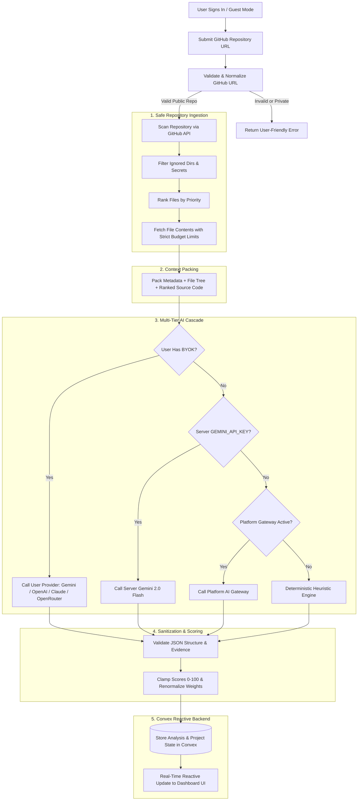

# Project Mentor AI

> **Automated, Evidence-Backed Engineering Audits & Technical Mentorship for GitHub Repositories.**

[](https://react.dev/)
[](https://vitejs.dev/)
[](https://convex.dev/)
[](https://www.typescriptlang.org/)
[](https://tailwindcss.com/)
[](LICENSE)
[](#-security--privacy-architecture)

---

## 📑 Table of Contents

- [Executive Summary](#-executive-summary)
- [The Idea: Why Project Mentor AI?](#-the-idea-why-project-mentor-ai)
  - [The Problem We Observed](#the-problem-we-observed)
  - [The Vision & Core Philosophy](#the-vision--core-philosophy)
- [How We Implemented It: Technical Architecture](#-how-we-implemented-it-technical-architecture)
  - [End-to-End System Pipeline](#end-to-end-system-pipeline)
  - [1. Safe & Budget-Capped Repository Ingestion](#1-safe--budget-capped-repository-ingestion)
  - [2. Context Packing & Token Optimization](#2-context-packing--token-optimization)
  - [3. Multi-Tiered AI Cascade & Bring-Your-Own-Key (BYOK)](#3-multi-tiered-ai-cascade--bring-your-own-key-byok)
  - [4. Mathematical Scoring Model & Sanitization](#4-mathematical-scoring-model--sanitization)
  - [5. Reactive Neobrutalist Interface](#5-reactive-neobrutalist-interface)
  - [6. Security & Tenant Isolation](#6-security--tenant-isolation)
- [The Solution We Got: What Project Mentor AI Delivers](#-the-solution-we-got-what-project-mentor-ai-delivers)
  - [Weighted 9-Category Health Score](#weighted-9-category-health-score)
  - [File-Level Evidence Citations](#file-level-evidence-citations)
  - [Actionable "Fix First" Prioritized Roadmaps](#actionable-fix-first-prioritized-roadmaps)
  - [100% Deterministic Fallback (Zero Downtime)](#100-deterministic-fallback-zero-downtime)
- [Technology Stack](#-technology-stack)
- [Project Directory Structure](#-project-directory-structure)
- [Getting Started & Local Setup](#-getting-started--local-setup)
  - [Prerequisites](#prerequisites)
  - [Installation Steps](#installation-steps)
  - [Environment Variables](#environment-variables)
  - [Available Scripts](#available-scripts)
- [Testing & Quality Assurance](#-testing--quality-assurance)
- [Security & Responsible AI Principles](#-security--responsible-ai-principles)
- [Roadmap & Future Enhancements](#-roadmap--future-enhancements)

---

## ⚡ Executive Summary

**Project Mentor AI** is an intelligent repository auditor and automated technical mentor. By supplying a public GitHub repository URL, engineers, team leads, and students receive a comprehensive, objective **health score (0–100)** across nine engineering dimensions, accompanied by:

- Concrete **strengths** and **weaknesses** with severity classifications,
- **Direct file-level citations** grounding every claim in actual repository code,
- A prioritized action plan detailing **what to fix first**.

> 🛡️ **Guaranteed Safe**: Project Mentor AI treats repositories purely as read-only structured data. It **never** executes code, downloads dependencies, executes arbitrary shell commands, or alters your codebase.

---

## 💡 The Idea: Why Project Mentor AI?

### The Problem We Observed

1. **The Code Review Bottleneck**:
   In engineering teams and academic environments, senior engineers and mentors spend countless hours conducting routine code reviews. Reviews frequently swing between nitpicking syntax and missing high-level architectural anti-patterns, security lapses, and documentation gaps.
2. **The Shallow Scope of Linters & SAST Tools**:
   Static analysis tools (ESLint, SonarQube, Semgrep) excel at discovering syntax errors, stylistic inconsistencies, or regex-matched CVE signatures. However, they cannot answer fundamental architectural questions:
   - _Does this project isolate business logic from delivery mechanisms?_
   - _Is the problem scope clearly articulated and validated with tests?_
   - _Is the data layer decoupled and secure against injection?_
3. **The Danger of Hallucinatory AI Code Generators**:
   Many modern AI tools attempt to write code without understanding whole-system constraints, producing boilerplate that exacerbates technical debt. Developers needed an analytical tool that **evaluates, mentors, and explains** rather than blindly generating code.

### The Vision & Core Philosophy

Project Mentor AI was built to function as an **on-demand Staff Engineer**:

- **Holistic Review**: Evaluate not just code syntax, but problem definition, architecture, database schemas, security posture, automated testing, documentation, innovation, and UX.
- **Zero Hallucination Mandate**: The AI is prohibited from inventing nonexistent files or making unsubstantiated claims. Every strength and finding must cite physical files in the repository.
- **Democratized Access**: Teams and students should not be locked into expensive proprietary SaaS tiers. Through **Bring-Your-Own-Key (BYOK)** support, users can plug in their own Gemini, OpenAI, Claude, or OpenRouter keys, while retaining access to a deterministic heuristic fallback if no key is present.

---

## ⚙️ How We Implemented It: Technical Architecture

### End-to-End System Pipeline



---

### 1. Safe & Budget-Capped Repository Ingestion

The repository ingest engine ([`src/convex/lib/repo.ts`](file:///c:/Users/bhanu/OneDrive/my%20family/project-review-ai/src/convex/lib/repo.ts)) enforces strict security and resource constraints:

- **Strict URL Validation**: Only `https://github.com/owner/repo` patterns are accepted. Subdomains, gists, raw IPs, and reserved GitHub namespaces (`topics`, `orgs`, `settings`, `explore`) are rejected immediately.
- **Directory Blacklist**: Bypasses heavy build artifacts, dependencies, and caches (`node_modules`, `.git`, `dist`, `build`, `.next`, `coverage`, `__pycache__`, `venv`, etc.).
- **Automatic Secret Shield**: Files named `.env`, `.env.*`, or containing private keys are **never** fetched (only `.env.example` templates are permitted to evaluate configuration hygiene).
- **Intelligent Priority Ranking**:
  Files are sorted by strategic engineering value rather than alphabetical order:
  1. `README.md`, `README.txt` (Problem definition, documentation)
  2. Manifests & Dependencies (`package.json`, `Cargo.toml`, `pyproject.toml`, `go.mod`)
  3. Entrypoints (`index.ts`, `main.py`, `app.tsx`, `server.ts`)
  4. Routing & Controllers (`routes/`, `controllers/`, `routers/`)
  5. Business Logic & Services (`services/`, `api/`)
  6. Components & Views (`components/`, `pages/`, `views/`)
  7. Data Models & Schemas (`schema.ts`, `models/`, `prisma/`, `migrations/`)
  8. Automated Tests (`tests/`, `spec/`, `__tests__/`, `e2e/`)
  9. Infrastructure & Configs (`Dockerfile`, `docker-compose.yml`, `tsconfig.json`)
- **Hard Resource Caps**:
  - Max **50 files** fetched per repository.
  - Max **48 KB** per individual file.
  - Max **320 KB** total payload context budget.
  - Max **1,200 filenames** in the structure tree.
    This prevents token exhaustion and stays well within GitHub API limits.

---

### 2. Context Packing & Token Optimization

The packed context generated in [`packProjectContext()`](file:///c:/Users/bhanu/OneDrive/my%20family/project-review-ai/src/convex/lib/repo.ts#L146-L174) constructs a token-efficient representation:

1. **Repository Metadata**: Name, description, primary language, stargazers, default branch.
2. **High-Level File Tree**: Tracked file names to give the model awareness of directory architecture without consuming tokens on full file contents.
3. **Selected File Contents**: Prioritized, truncated file contents separated by clean delimiter banners.

---

### 3. Multi-Tiered AI Cascade & Bring-Your-Own-Key (BYOK)

The analysis runner ([`src/convex/analyses.ts`](file:///c:/Users/bhanu/OneDrive/my%20family/project-review-ai/src/convex/analyses.ts)) implements an intelligent 4-tier fallback cascade:

| Tier       | Engine                       | Description                                                                                                                                         |
| :--------- | :--------------------------- | :-------------------------------------------------------------------------------------------------------------------------------------------------- |
| **Tier 1** | **User BYOK**                | User-supplied key for **Google Gemini**, **OpenAI**, **Anthropic Claude**, or **OpenRouter** (100+ models).                                         |
| **Tier 2** | **Server Key**               | Server-configured `GEMINI_API_KEY` (`gemini-2.0-flash`).                                                                                            |
| **Tier 3** | **Platform Gateway**         | Managed completion gateway via `@vly-ai/integrations`.                                                                                              |
| **Tier 4** | **Deterministic Heuristics** | Internal rule-based structural analyzer that inspects manifests, dependencies, test suites, schemas, and configurations without external API calls. |

> 🛡️ **Zero Failure Guarantee**: If an API key is invalid, rate-limited, or network-blocked, the pipeline seamlessly degrades to the next tier, guaranteeing that a user always receives a useful analysis.

---

### 4. Mathematical Scoring Model & Sanitization

Scores are computed with strict mathematical normalization in [`src/convex/lib/scoring.ts`](file:///c:/Users/bhanu/OneDrive/my%20family/project-review-ai/src/convex/lib/scoring.ts):

$$\text{Final Health Score} = \frac{\sum_{i=1}^{n} (\text{Clamped Score}_i \times \text{Weight}_i)}{\sum_{i=1}^{n} \text{Weight}_i}$$

- **Score Clamping**: All raw outputs from AI or heuristics are forced into `[0, 100]` through `clampScore()`.
- **Weight Renormalization**: If a category cannot be evaluated due to missing repository data, the remaining category weights rebalance dynamically so the final score is never skewed.
- **Evidence Verification**: Strengths and weaknesses must cite real paths from the scanned file list.
- **Severity Normalization**: Weaknesses are mapped to validated severities (`critical`, `high`, `medium`, `low`).

---

### 5. Reactive Neobrutalist Interface

Built with **React 19**, **Tailwind CSS v4**, and custom **Neobrutalism UI tokens** ([`src/components/nb.tsx`](file:///c:/Users/bhanu/OneDrive/my%20family/project-review-ai/src/components/nb.tsx)):

- Bold, high-contrast dark aesthetic with hard borders and tactical shadows.
- Distinctive typography using **Space Grotesk** for headings and **JetBrains Mono** for code and technical evidence.
- Real-time reactive data subscription powered by Convex: watch analysis status transition live from `scanning` $\rightarrow$ `analyzing` $\rightarrow$ `complete`.

---

### 6. Security & Tenant Isolation

- **Write-Only BYOK Encryption**: User API keys are stored server-side. Public queries only return masked previews (e.g., `AIza…3f9a`). Keys are never sent to browser clients.
- **Tenant Isolation**: Every database query and mutation verifies `userId` via Convex Auth. Projects and analyses belonging to other users return `PROJECT_NOT_FOUND`, preventing authorization bypass.
- **Zero Sandboxed Code Execution**: Repository files are read purely as UTF-8 strings. No scripts, compilers, package managers, or interpreters are ever run on uploaded code.

---

## 🎯 The Solution We Got: What Project Mentor AI Delivers

### Weighted 9-Category Health Score

Every project is evaluated across nine weighted criteria representing a balanced engineering standard:

| Category               | Weight  | What We Evaluate                                                                   |
| :--------------------- | :-----: | :--------------------------------------------------------------------------------- |
| **Architecture**       | **15%** | Modularity, separation of concerns, layer decoupling, directory organization.      |
| **Code Quality**       | **15%** | Readability, naming conventions, DRY/SOLID principles, complexity management.      |
| **Security**           | **15%** | Secret management, input validation, injection risks, authentication guardrails.   |
| **Problem Definition** | **10%** | README clarity, problem domain description, value proposition, feature roadmap.    |
| **Database**           | **10%** | Schema normalization, migration files, index strategies, data access abstractions. |
| **Testing**            | **10%** | Unit, integration, and E2E test suites, fixture setups, edge-case coverage.        |
| **Documentation**      | **10%** | Setup walkthroughs, environment variable guides, architecture diagrams, API specs. |
| **Innovation**         | **10%** | Creative problem-solving, modern tech stack utilization, technical ambition.       |
| **UX**                 | **5%**  | User experience considerations, error handling feedback, accessibility signals.    |

---

### File-Level Evidence Citations

Unlike generic AI chat interfaces that provide vague advice, Project Mentor AI attaches verified file tags to every observation:

```
[STRENGTH] Clear Service Layer Decoupling
Detail: Business logic is decoupled from route controllers, simplifying unit testing.
Evidence: 📁 src/services/ai.ts  📁 src/services/scoring.ts

[WEAKNESS - HIGH] Missing Rate Limiting on Authentication Endpoints
Detail: Authentication and project ingestion routes do not implement throttling or rate limits.
Evidence: 📁 src/convex/auth.ts  📁 src/convex/http.ts
```

---

### Actionable "Fix First" Prioritized Roadmaps

Each analysis concludes with an ordered list of high-leverage refactorings:

1. _Add integration tests for user authentication and session revocation._
2. _Introduce rate limiting middleware on public mutation endpoints._
3. _Provide a `.env.example` file detailing required environment variables._

---

### 100% Deterministic Fallback (Zero Downtime)

When internet connectivity to external AI providers fails or API rate limits are exceeded, Project Mentor AI executes an offline structural heuristic audit:

- Detects presence and depth of `README.md`,
- Inspects test directory structures (`tests/`, `spec/`),
- Evaluates `.env.example` existence for security posture,
- Counts and audits runtime dependencies in `package.json`,
- Honestly labels the report as a **structural heuristic scan** with full transparency.

---

## 💻 Technology Stack

| Layer                      | Technologies                                                                                                                   |
| :------------------------- | :----------------------------------------------------------------------------------------------------------------------------- |
| **Frontend Framework**     | **React 19**, **Vite 7**, **TypeScript 5.9**                                                                                   |
| **Routing & Navigation**   | **React Router 7**                                                                                                             |
| **Styling & UI Kit**       | **Tailwind CSS v4**, **shadcn/ui**, **Radix UI**, **Lucide Icons**                                                             |
| **Animations & Polish**    | **Framer Motion 12**, **tw-animate-css**                                                                                       |
| **Backend & Real-Time DB** | **Convex 1.30** (serverless functions, reactive queries, internal mutations)                                                   |
| **Authentication**         | **Convex Auth** (Email OTP, Anonymous Guest sessions, Role-Based Access)                                                       |
| **AI Providers (BYOK)**    | **Google Gemini** (`gemini-2.0-flash`), **OpenAI** (`gpt-4o-mini`), **Anthropic Claude** (`claude-3-5-sonnet`), **OpenRouter** |
| **Testing Engine**         | **Bun Test Runner**                                                                                                            |

---

## 📂 Project Directory Structure

```
project-review-ai/
├── index.html                      # HTML5 entry point & Google Fonts loading
├── vite.config.ts                  # Vite build & plugin configuration
├── package.json                    # Project dependencies & operational scripts
├── tsconfig.json                   # TypeScript project references
├── .gitignore                      # Git exclusion rules (secrets, artifacts, dependencies)
│
├── src/
│   ├── main.tsx                    # React application root & provider tree
│   ├── index.css                   # Global styles, Tailwind v4 theme variables
│   │
│   ├── pages/
│   │   ├── Landing.tsx             # Public landing & feature showcase
│   │   ├── Auth.tsx                # Email OTP & guest authentication portal
│   │   ├── Dashboard.tsx           # User project dashboard & quick-scan input
│   │   ├── ProjectPage.tsx         # Detailed analysis view (scorecards, citations)
│   │   ├── SettingsPage.tsx        # Bring-Your-Own-Key (BYOK) management
│   │   ├── AdminPage.tsx           # Role management, platform metrics & project audit
│   │   └── NotFound.tsx            # 404 handler
│   │
│   ├── components/
│   │   ├── nb.tsx                  # Neobrutalist design system components (buttons, badges, cards)
│   │   ├── AppHeader.tsx           # Global navigation & user status bar
│   │   ├── RequireAuth.tsx         # Route authentication guards
│   │   ├── LogoDropdown.tsx        # App branding & navigation menu
│   │   └── ui/                     # Accessible UI primitives (Radix UI / shadcn)
│   │
│   ├── convex/
│   │   ├── schema.ts               # Database schema (users, projects, analyses, aiKeys)
│   │   ├── auth.ts                 # Convex Auth configuration & handlers
│   │   ├── projects.ts             # Project CRUD mutations & queries (ownership-scoped)
│   │   ├── analyses.ts             # Node.js action running GitHub fetch & AI review
│   │   ├── analysesStore.ts        # Internal mutations & queries for analysis results
│   │   ├── aiKeys.ts               # BYOK key encryption, preview masking & deletion
│   │   ├── admin.ts                # Administrator bootstrapping, role updates, statistics
│   │   └── lib/
│   │       ├── repo.ts             # GitHub URL validation, priority file ranking & context packing
│   │       ├── scoring.ts          # 9-category weighted algorithm, clamping & renormalization
│   │       └── aiProviders.ts      # Multi-provider catalog & direct API client callers
│   │
│   └── hooks/
│       ├── use-auth.ts             # Authentication state & session helpers
│       └── use-mobile.ts           # Responsive viewport hook
│
└── tests/
    ├── repo.test.ts                # URL parsing, secret file blocking, context packing tests
    ├── scoring.test.ts             # Category weighting, clamping, and math verification tests
    └── aiProviders.test.ts         # Provider catalog, key masking, and validation tests
```

---

## 🚀 Getting Started & Local Setup

### Prerequisites

You can run Project Mentor AI with either **Node.js** or **Bun**:

- **Node.js**: v18.0.0 or higher (`npm` / `npx`)
- **Bun**: v1.1.0 or higher (optional, recommended for fast tests)
- A free [Convex account](https://convex.dev) for serverless backend deployment.

---

### Installation Steps

1. **Clone the Repository**:

   ```bash
   git clone https://github.com/bhanuprasad21122006-lgtm/project-review-ai.git
   cd project-review-ai
   ```

2. **Install Dependencies**:

   ```bash
   # Using npm
   npm install

   # OR using Bun
   bun install
   ```

3. **Initialize Convex Backend**:
   Run the development command. On the first run, Convex will prompt you to log in and automatically create a development deployment:

   ```bash
   # Using npm
   npx convex dev

   # In a separate terminal, start the Vite development server
   npm run dev
   ```

4. **Open the Application**:
   Navigate to [http://localhost:5173](http://localhost:5173) in your browser.

---

### Environment Variables

Configure optional environment variables in your Convex deployment dashboard or local `.env.local`:

| Variable          | Required | Description                                                             |
| :---------------- | :------: | :---------------------------------------------------------------------- |
| `VITE_CONVEX_URL` | **Yes**  | Convex deployment URL (automatically set by `convex dev`).              |
| `CONVEX_SITE_URL` | **Yes**  | Site URL for authentication redirects (e.g. `http://localhost:5173`).   |
| `GEMINI_API_KEY`  |    No    | Server-wide Google Gemini API key (serves as Tier 2 fallback).          |
| `GITHUB_TOKEN`    |    No    | GitHub Personal Access Token. Raises API limit from 60 to 5,000 req/hr. |

> 💡 **Notice**: End users do not need access to your server variables. Each user can configure their personal API keys directly from the **Settings** page in the UI.

---

### Available Scripts

| Command                       | Description                                                          |
| :---------------------------- | :------------------------------------------------------------------- |
| `npm run dev` / `bun run dev` | Launches the local Vite development server with HMR.                 |
| `npm run build`               | Validates TypeScript and generates the production bundle in `dist/`. |
| `npm run lint`                | Runs ESLint across the codebase.                                     |
| `npm run format`              | Formats all code files using Prettier.                               |
| `bun test tests/`             | Executes the comprehensive 45-test suite.                            |

---

## 🧪 Testing & Quality Assurance

The test suite validates security boundaries, algorithm invariants, and provider integrity:

```bash
bun test tests/
```

- **`repo.test.ts` (18 tests)**:
  - Validates GitHub URL normalization and rejection of malicious/reserved paths.
  - Ensures `.env` files and private keys are never included in context.
  - Enforces file count caps (50), file size limits (48 KB), and total payload bounds (320 KB).
- **`scoring.test.ts` (15 tests)**:
  - Verifies category weights sum to exactly 1.0.
  - Verifies score clamping to the range `0..100`.
  - Tests dynamic renormalization when categories are missing from model output.
  - Ensures unknown categories are safely discarded.
- **`aiProviders.test.ts` (12 tests)**:
  - Confirms provider catalog definitions for Gemini, OpenAI, Claude, and OpenRouter.
  - Verifies key masking functions (`AIza…3f9a`) never expose raw secrets.
  - Tests basic key format validation.

---

## 🛡️ Security & Responsible AI Principles

1. **Evidence-Grounded AI**:
   Prompts instruct models to cite physical file paths for every claim. If an aspect of the architecture cannot be proven from the scanned files, the model is instructed to mark it as **"Not verifiable from provided repository data"** rather than speculating.
2. **Zero Code Execution**:
   Code is treated strictly as static text. No build scripts, interpreters, shell commands, or network calls are triggered on scanned code.
3. **Write-Only BYOK**:
   User API keys are write-only from the client perspective: keys can be added, updated, or deleted, but cannot be retrieved via queries.
4. **Tenant Isolation**:
   All database records are scoped by `userId`. Unauthenticated or cross-tenant access returns standard 404 responses without disclosing repository metadata.

---

## 🗺️ Roadmap & Future Enhancements

- [ ] **Private Repository Support**: Secure OAuth integration for scanning private repositories with ephemeral access tokens.
- [ ] **Historical Trend Graphs**: Visualize project score progression across successive commits and pull requests.
- [ ] **GitHub Action CI Bot**: Automatic PR review comments summarizing health score deltas and architectural risks.
- [ ] **Viva & Interview Prep Simulator**: Interactive AI mock technical interview based on the scanned project architecture.
- [ ] **PDF & Markdown Audit Export**: One-click generation of formatted audit reports for stakeholders and hackathon judges.

---

## 📄 License

This project is licensed under the [MIT License](LICENSE).

---

<p align="center">
  <b>Project Mentor AI</b> • Built with precision, transparency, and care for modern software engineering.
</p>
